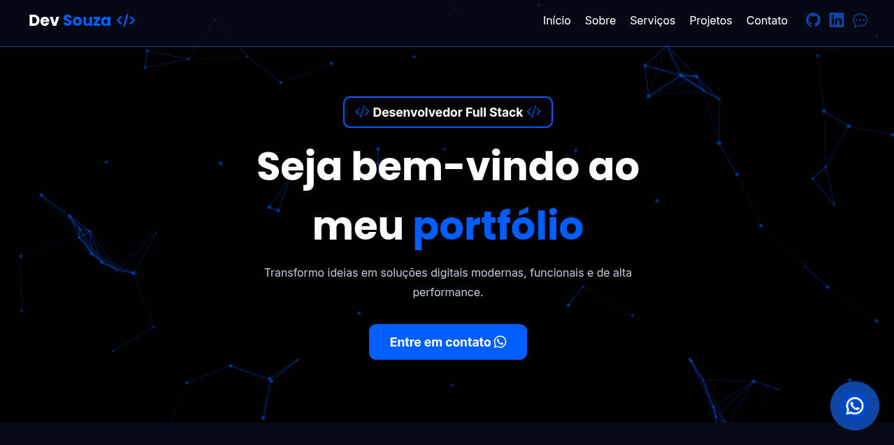

# 🚀 Portfólio Dev Souza — Desenvolvedor Full Stack

<p align="center">
  
</p>

<p align="center">
  <a href="https://github.com/DevSouza80?tab=repositories">
    
  </a>
  <a href="https://www.linkedin.com/in/pedro-henrique-77a5b4409">
    
  </a>
  <a href="https://wa.me/5524992630568">
    
  </a>
</p>

---

## 📸 Preview

> **Substitua a imagem abaixo pelo print do seu projeto:**

<!-- Cole aqui o print do seu portfólio -->


---

## 📋 Sobre o Projeto

Portfólio profissional desenvolvido para apresentar meus serviços, habilidades e projetos como desenvolvedor Full Stack. A aplicação conta com design moderno, animações suaves, partículas interativas no fundo e formulário de contato integrado ao WhatsApp.

---

## ✨ Funcionalidades

- **Hero Section** com apresentação e chamada para ação via WhatsApp
- **Seção Sobre** com foto de perfil e grid de tecnologias dominadas
- **Seção Serviços** com cards animados (Criação de Sites, Sistemas e Manutenção)
- **Seção Projetos** com grid de projetos reais e links para visualização
- **Formulário de Contato** integrado com redirecionamento para WhatsApp
- **Menu Mobile** responsivo com animação de abertura/fechamento
- **Partículas animadas** no background via tsParticles
- **Botão flutuante do WhatsApp** com animação de pulso e tooltip
- **Animações de scroll** com AOS (Animate On Scroll)

---

## 🛠️ Tecnologias Utilizadas

| Tecnologia | Função |
|---|---|
| HTML5 | Estrutura semântica da página |
| CSS3 | Estilização, responsividade e animações |
| JavaScript | Interatividade e lógica do front-end |
| Bootstrap Icons | Ícones da interface |
| AOS Library | Animações ao rolar a página |
| tsParticles | Efeito de partículas no fundo |

---

## 📁 Estrutura do Projeto

```
portfolio/
│
├── index.html
│
└── assets/
    ├── css/
    │   ├── style.css         # Estilos principais
    │   ├── resete.css        # Reset de estilos
    │   ├── framework.css     # Utilitários e grid
    │   ├── media.css         # Responsividade
    │   ├── color.css         # Variáveis de cor
    │   └── font.css          # Variáveis de fonte
    │
    ├── js/
    │   ├── menu.js           # Menu mobile
    │   ├── particles.js      # Configuração das partículas
    │   ├── form.js           # Envio de formulário via WhatsApp
    │   └── animation.js      # Inicialização do AOS
    │
    └── img/
        ├── profile.png       # Foto de perfil
        ├── projeto1.png      # Screenshot projeto Brasa Burger
        ├── projeto2.png      # Screenshot projeto RP Refrigeração
        ├── turboFlix.png     # Screenshot projeto Turbo Fix
        ├── barberShop.png    # Screenshot projeto Barbe Shopp
        └── ...               # Ícones e outros recursos visuais
```

---

## 🖥️ Seções do Portfólio

### 🏠 Início
Apresentação com título animado, descrição e botão de contato via WhatsApp.

### 👤 Sobre
Foto de perfil, descrição profissional e grid com as principais tecnologias dominadas: HTML5, CSS3, Bootstrap, JavaScript, React.js, MySQL, Git e GitHub.

### 💼 Serviços
Três cards descrevendo os serviços oferecidos:
- **Criação de Sites** — Sites institucionais, landing pages e portfólios
- **Criação de Sistemas** — Sistemas web personalizados
- **Manutenção** — Suporte técnico, correção de bugs e atualizações

### 📂 Projetos
Grid com quatro projetos reais desenvolvidos:

| Projeto | Descrição | Link |
|---|---|---|
| Brasa Burger | Cardápio online com carrinho dinâmico | [Ver projeto](https://projeto-cardapio-online-tau.vercel.app/) |
| RP Refrigeração | Landing page de serviços de refrigeração | [Ver projeto](https://rprefrigeracao.com/) |
| Turbo Fix | Landing page para oficina mecânica | [Ver projeto](https://projeto-turbo-fix.vercel.app/) |
| Barbe Shopp | Landing page para barbearia | [Ver projeto](https://remarkable-cendol-5b637d.netlify.app/) |

### 📬 Contato
Formulário com campos de nome, e-mail e mensagem, com envio direto para o WhatsApp.

---

## 📱 Responsividade

O portfólio é totalmente responsivo, adaptando o layout para desktops, tablets e dispositivos móveis, com menu hambúrguer dedicado para telas menores.

---

## 🚀 Como Rodar Localmente

```bash
# Clone o repositório
git clone https://github.com/DevSouza80/portfolio.git

# Acesse a pasta
cd portfolio

# Abra o arquivo no navegador
# Basta abrir o index.html diretamente, ou usar uma extensão como Live Server no VS Code
```

> Não há dependências de instalação — o projeto utiliza apenas HTML, CSS e JavaScript puro com CDNs.

---

## 📞 Contato

Tem um projeto em mente? Vamos conversar!

- 💬 **WhatsApp:** [+55 (24) 99263-0568](https://wa.me/5524992630568)
- 💼 **LinkedIn:** [Pedro Henrique](https://www.linkedin.com/in/pedro-henrique-77a5b4409)
- 🐙 **GitHub:** [DevSouza80](https://github.com/DevSouza80)

---

<p align="center">
  © 2026 <strong>Dev Souza</strong> — Todos os direitos reservados.
</p>
